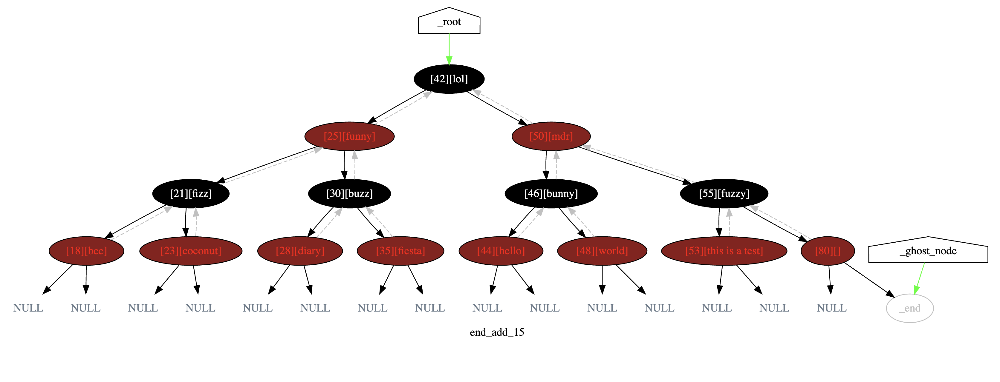

# Red Black binary trees

## Background:

C++ Implementation of self-balancing binary search tree with [Red Black](https://en.wikipedia.org/wiki/Red%E2%80%93black_tree) technique.
This was done as part of the [ft_containers](https://www.github.com/backslash-zero/42-ft_containers) project for 42 School.

Each node stores an extra bit representing "color" ("red" or "black"), used to ensure that the tree remains balanced during insertions and deletions.

## Debugging use dot files:

The [redBlackTree_debug.hpp](redBlackTree_debug.hpp) helps generating a .dot file that allows us to generate these handy graphs for debugging.

---

### Ressources:

[This](https://www.youtube.com/watch?v=qvZGUFHWChY&list=PL9xmBV_5YoZNqDI8qfOZgzbqahCUmUEin) excellent YouTube playlist about Red Blac Trees and insertions.
[This](https://www.geeksforgeeks.org/red-black-tree-set-3-delete-2/) Geeks for Geeks article for deletions.
[My implementation](https://www.github.com/backslash-zero/42-ft_containers) within ft_containers project at 42.
[https://graphviz.org/](https://graphviz.org/) for DOT language help.
